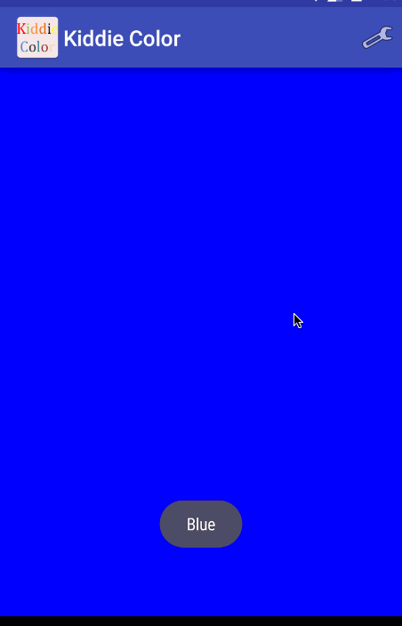

# Kiddie-Color
## Learn colors by playing

###Walkthrough

###**Features:**
1. Kiddie Color is a simple app aimed at kids/tots aged between 1-3 years.
2. The app displays 50 different colors with their names.
3. Swipe left/right to view different colors. 
4. App select colors randomly.
